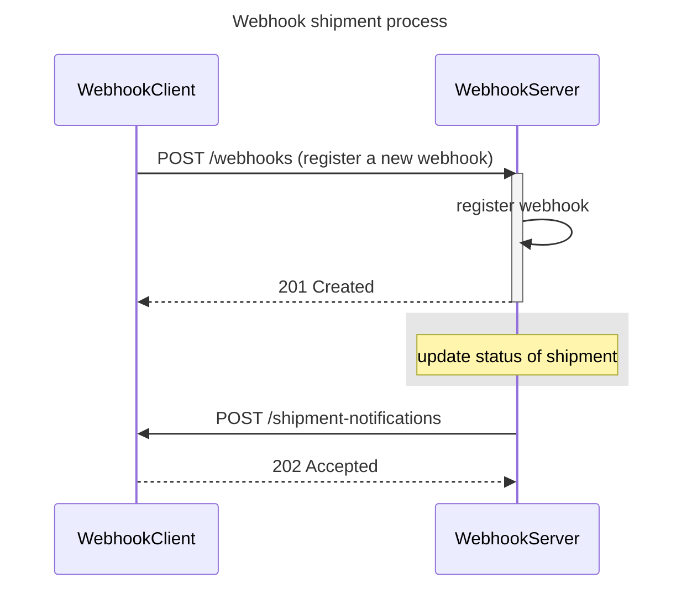

# Spring Webhook Demo

Demo project that shows **how to implement Webhooks with Spring Boot 3 and Java 21**.  
It contains two applications:

- **webhook-server** → producer of shipment events (like a courier / shipping company).
- **webhook-client** → consumer (like an e-commerce) that receives webhook notifications.

Unlike Pub/Sub brokers, here the producer calls consumers directly via **HTTP callbacks** (webhooks).

This project is a companion demo for my book [Spring Boot 3 API Mastery](https://amzn.to/41LwDqN).
- In the book, I focus more on Publisher/Subscriber patterns (Kafka, async).
- Here, the blog/demo complements it by showing Webhooks as a simpler alternative: [Webhook with Spring Boot](https://www.vincenzoracca.com/en/blog/framework/spring/spring-webhook).



Figure 1 - Webhook flow - client registers, server sends events

---

## ✨ Features

- **In-memory storage** (no DB required).
- **Webhook registration**: consumers register their callback URL and which events they are interested in (`ALL`, `COMPLETED`, `CANCELED`).
- **Event publishing**: server generates shipment events and delivers them to subscribed clients.
- **HTTP retry with backoff**: retries are automatically performed on delivery failures.
- **Idempotency**: client ignores duplicate events (same `eventId`).
- **Security**:
    - Events are signed with **HMAC-SHA256** (`X-Signature`).
    - Each request includes a **timestamp** (`X-Timestamp`).
    - Client validates signature and rejects requests outside a **time window** (anti-replay).

---

## 🛠️ Tech Stack
- Java 21
- Spring Boot 3
- Spring Web
- Spring Retry

## 📂 Project Structure
```
spring-webhook/
├── LICENSE
├── README.md
├── webhook-client
│   ├── HELP.md
│   ├── mvnw
│   ├── mvnw.cmd
│   ├── pom.xml
│   └── src
│       ├── main
│       │   ├── java
│       │   │   └── com
│       │   │       └── vincenzoracca
│       │   │           └── webhookclient
│       │   │               ├── WebhookClientApplication.java
│       │   │               ├── api
│       │   │               │   └── ShipmentNotificationController.java
│       │   │               ├── dao
│       │   │               │   ├── ShipmentEventDao.java
│       │   │               │   └── impl
│       │   │               │       └── ShipmentEventInMemoryDao.java
│       │   │               ├── model
│       │   │               │   └── ShipmentEvent.java
│       │   │               ├── service
│       │   │               │   ├── ShipmentConsumer.java
│       │   │               │   └── impl
│       │   │               │       └── ShipmentWebhookConsumer.java
│       │   │               └── util
│       │   │                   └── SecurityClientUtil.java
│       │   └── resources
│       │       ├── application.properties
└── webhook-server
    ├── HELP.md
    ├── mvnw
    ├── mvnw.cmd
    ├── pom.xml
    └── src
        ├── main
        │   ├── java
        │   │   └── com
        │   │       └── vincenzoracca
        │   │           └── webhookserver
        │   │               ├── WebhookServerApplication.java
        │   │               ├── api
        │   │               │   ├── SimulatorController.java
        │   │               │   └── WebhookController.java
        │   │               ├── config
        │   │               │   └── AppConfig.java
        │   │               ├── dao
        │   │               │   ├── WebhookDao.java
        │   │               │   └── impl
        │   │               │       └── WebhookInMemoryDao.java
        │   │               ├── model
        │   │               │   ├── ShipmentEvent.java
        │   │               │   ├── Webhook.java
        │   │               │   └── WebhookRegistrationRequest.java
        │   │               ├── service
        │   │               │   ├── ShipmentProducer.java
        │   │               │   └── impl
        │   │               │       ├── ShipmentWebhookProducer.java
        │   │               │       └── WebhookService.java
        │   │               └── util
        │   │                   ├── ClientInvoker.java
        │   │                   └── SecurityServerUtil.java
        │   └── resources
        │       ├── application.properties
```

---

## ▶️ How to Run

### 1. Start the server
```bash
cd webhook-server
./mvnw spring-boot:run
```
Server will start on http://localhost:8080.

### 2. Start the client
```bash
cd webhook-client
./mvnw spring-boot:run
```
Client will start on http://localhost:8081

## 🧪 Try it out

### 1. Register a webhook
```bash
curl --location 'localhost:8080/webhooks' \
--header 'Content-Type: application/json' \
--data '{
    "callbackUrl": "http://localhost:8081/shipment-notifications",
    "eventFilter": "COMPLETED"
}'
```

The response will be:

```json
{
    "webhookId": "35325894-37fa-4711-ac35-d16d04528ae9",
    "callbackUrl": "http://localhost:8081/shipment-notifications",
    "secret": "secret",
    "eventFilter": "COMPLETED"
}
```

➡️ The server stores the subscription (in memory).

### 2. Simulate an event
```bash
curl --location 'localhost:8080/simulate' \
--header 'Content-Type: application/json' \
--data '{
    "eventId": "20250817",
    "orderId": "1",
    "status": "COMPLETED"
}'
```

The HTTP response will be `204 No Content`.

➡️ The client receives the webhook, verifies signature + timestamp, and processes the event.

The highlighted section shows a sample HTTP POST request sent from the server to the client to notify a shipment event. It includes headers such as Content-Type, X-Signature (HMAC signature for security), and X-Timestamp (for anti-replay protection), along with a JSON payload containing the event details. The client responds with HTTP 202, indicating successful receipt of the notification.

```bash
POST /shipment-notifications HTTP/1.1
Host: localhost:8081
HTTP2-Settings: AAEAAEAAAAIAAAAAAAMAAAAAAAQBAAAAAAUAAEAAAAYABgAA
User-Agent: Java-http-client/23.0.2
Content-Type: application/json
X-Signature: sha256=6f8a64a66deaea10ce4a96088c918c2094cbef2385c8682326515a45a1f4588e
X-Timestamp: 1757631792175

{"eventId":"20250817","orderId":"2","status":"COMPLETED"}
HTTP/1.1 202 
Content-Length: 0
Date: Thu, 11 Sep 2025 23:03:12 GMT
```

➡️ If you repeat the same event, it will be ignored (idempotency).

## 🔐 Security Explained

- HMAC Signature
The server signs each event with a secret known only by server & client.
```
signature = HMAC_SHA256(secret, timestamp + "\n" + rawBody)
```

Sent in header:
```
X-Timestamp: 1737079000000
X-Signature: sha256=6f1b8c...
```

- Anti-replay window
The client only accepts events within a 5 minute window.
It also could keeps track of (timestamp|signature) already seen to prevent replays inside that window.
- Idempotency
The client stores received eventId.
If the same event arrives again (legit retries), it is acknowledged but not re-processed.

## ⚠️ Disclaimer

This project is a demo:
- All data is stored in-memory (lost on restart).
- A single shared secret is used (for simplicity).
- In production you should use:
  - A persistent DB for subscriptions & events,
  - Per-client secrets,
  - Secret rotation,
  - Stronger anti-replay (e.g. Redis TTL cache),
  - Monitoring and dead-letter handling.

## 📚 Useful resources
- https://webhooks.fyi/security/replay-prevention
- https://www.techtarget.com/searchAppArchitecture/tip/Webhook-security-Risks-and-best-practices-for-mitigation
- https://developer.paypal.com/api/rest/webhooks/#link-eventheadervalidation
- https://developer.paypal.com/api/rest/webhooks/rest/
